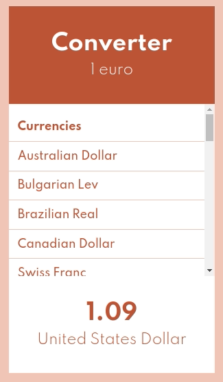

# Converter V2

## Objectif

Permettre la conversion d'un euro en différentes monnaies.
Ajouter la conversion lors du clic sur une des devises proposées.

## Prototypes

## Stack technique

react, sass, babel, webpack

## Instructions

🔺 nécessite npm ou yarn

1. Cloner le repo github
2. `yarn` ou `npm i`
3. `yarn start`